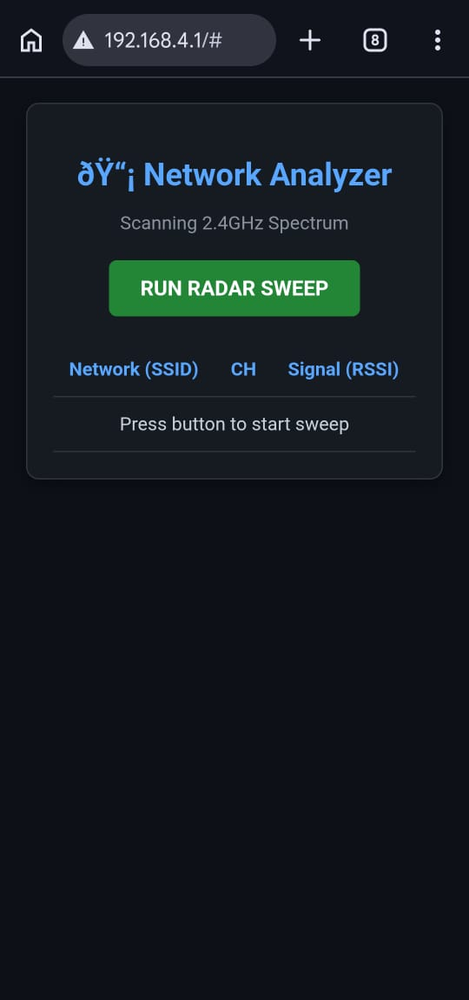
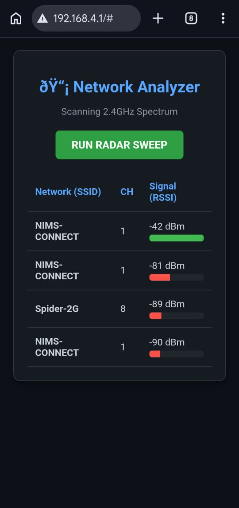

# ESP8266 Wi-Fi Network & Channel Scanner 📡

A portable wireless environment analyzer built using the ESP8266 microcontroller. 

This project utilizes the ESP8266 in a dual `WIFI_AP_STA` (Access Point + Station) mode. It broadcasts its own local network to host a tactical web dashboard while simultaneously using its antenna to sweep the 2.4 GHz spectrum. It detects surrounding Wi-Fi routers, mobile hotspots, and hidden networks, displaying their signal strength (RSSI) and channels in real-time.

  <table>
    <tr>
      <td>
        
         
        
<i>Initial Screen</i>

      </td>
      <td>
        <!-- REPLACE THE FILENAME BELOW with the name of your second image -->
        
         
        
<i>Radar Sweep Results</i>

      </td>
    </tr>
  </table>

## Features
## Features
* **Dual-Mode Networking:** Runs an Access Point and scans as a Station simultaneously.
* **Tactical Dashboard:** A sleek, dark-mode web UI with dynamic signal strength bars.
* **Hidden Network Detection:** Reveals the presence and strength of networks even if they aren't broadcasting their SSID.
* **Asynchronous Fetching:** Uses JavaScript `fetch()` to update scan results without needing to reload the web page.

## Hardware Required
* ESP8266 Development Board (e.g., NodeMCU 1.0 / ESP-12E)
* Micro-USB Data Cable (for power and programming)

## Software & Libraries Used
* `ESP8266WiFi.h` (For AP broadcasting and network scanning)
* `ESP8266WebServer.h` (For hosting the local dashboard)

## How to Use
1. Flash the code to your ESP8266 using the Arduino IDE.
2. Connect your phone or laptop to the **ESP_Scanner_Hub** Wi-Fi network (Password: `password123`).
3. Open a web browser and navigate to `http://192.168.4.1`.
4. Tap the **RUN RADAR SWEEP** button.
5. Wait ~3 seconds for the antenna to sweep the area, and watch the results populate!
